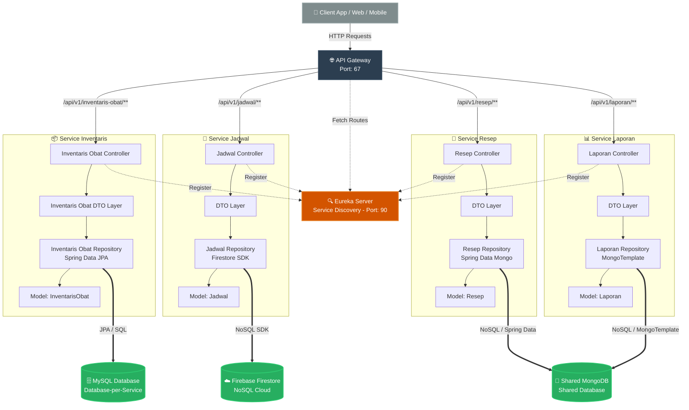
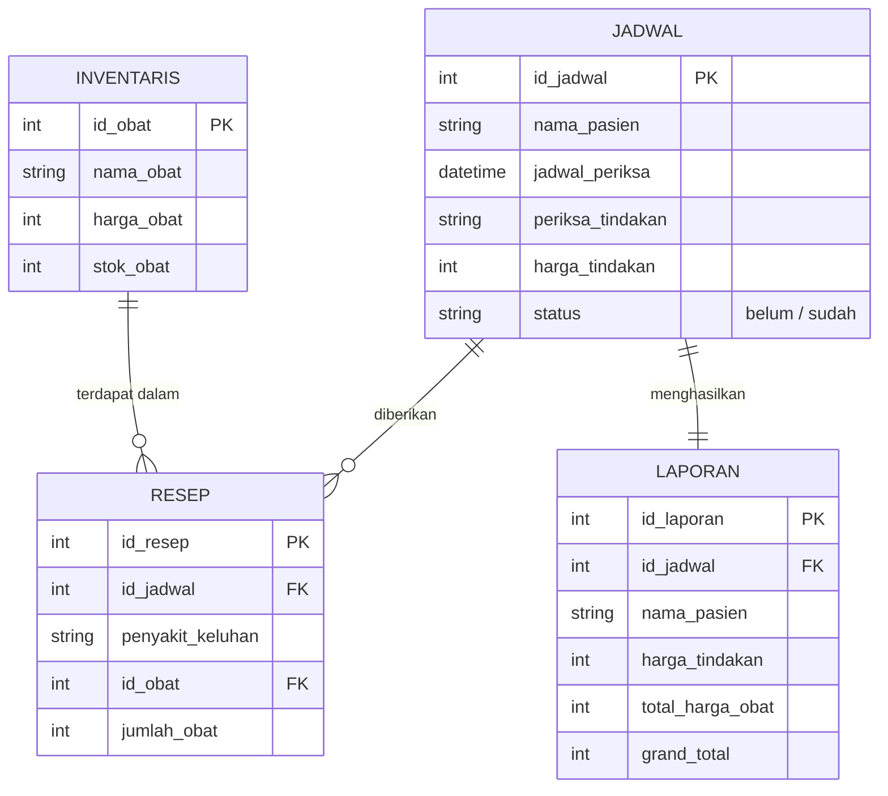
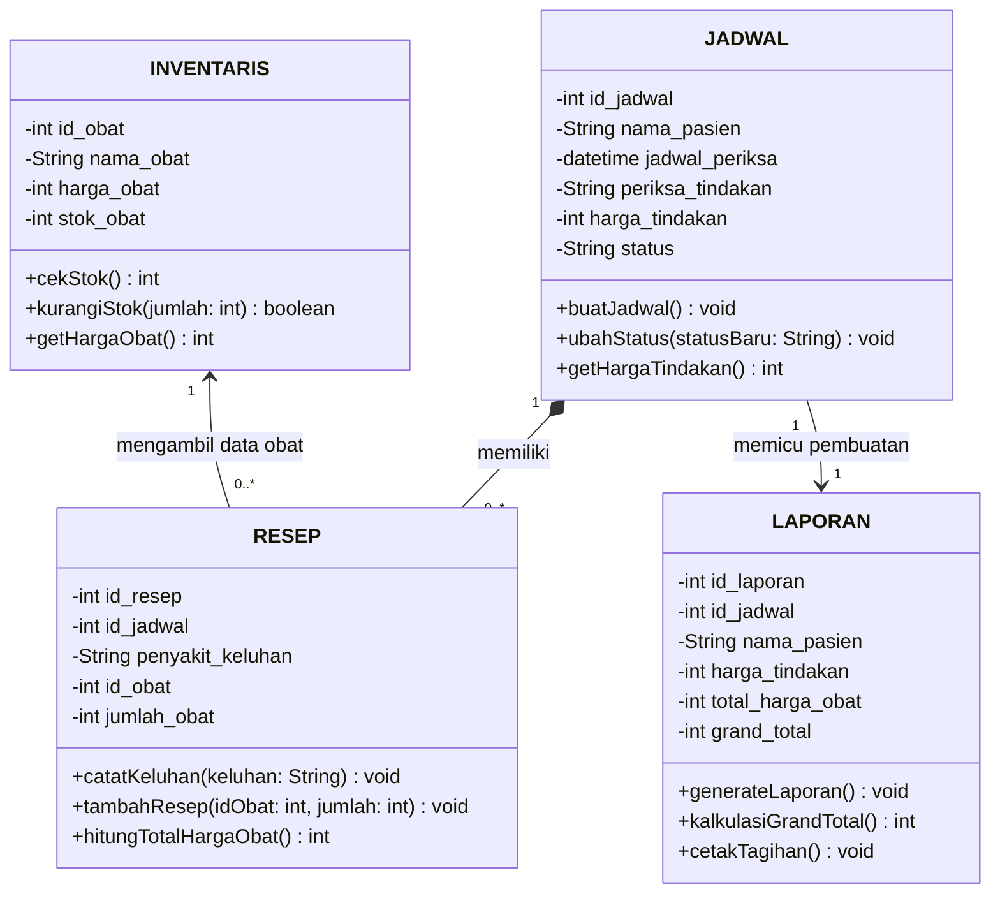

jadi 
inevstaris berisi tentang list obat obatan dan harga obat

jadwal berisi tentang pasien,jadwal periksa, periksa/tindakan, status periksa(belum/sudah)

resep berisi tentang resep obat setiap penyakit/setelah tindakan

laporan berisi tentang laporan nama pasien, harga periksa/tindakan , dan obatan yang dibeli dan total semua dari periksa/tindakan dan harga obat jika ada

jadi flow nya 
pasien akan bikin jadwal periksa/tindakan, jika belom status nya belom, setelah dilakukan periksa/tindakan, akan diberikan obat atau tidak, nanti status nya menjadi sudah periksa, jika ada obat yang perlu akan memberikan resep dan mengurangi stok obat di investaris, dan akan  total nya akan masuk dalam laporan keuangan.

